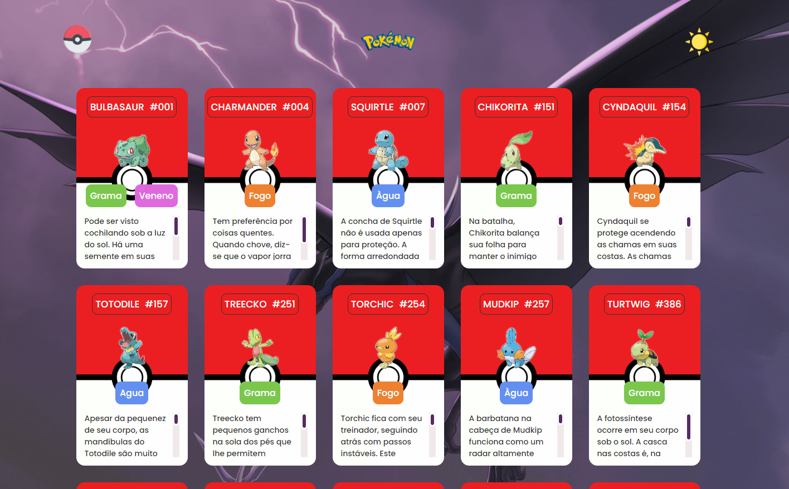

    

## 🖥️ Projeto
Esse é um projeto de listagem de Pokémon em cards utilizando HTML, CSS e JavaScript. O projeto foi desenvolvido durante o evento do Dev em Dobro.
Estão listados neste projeto todos os três pokémons iniciais das nove gerações de Pokémon, sendo eles de grama, fogo e água.

## ⚙ Funcionalidades
- Tema escuro: O usuário pode alternar entre o tema claro e escuro;
- Infos gerais: Cada card representa um pokémon, apresentando número de ordem, tipagem, descrição;

## 🚀 Tecnologias
- HTML
- CSS
- JavaScript
- Git e Github
